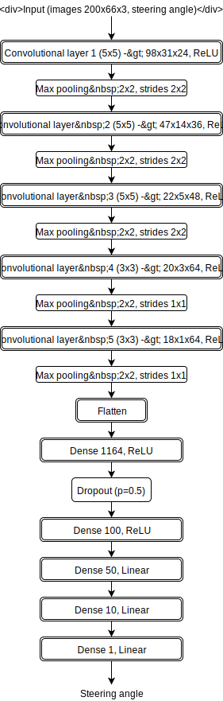
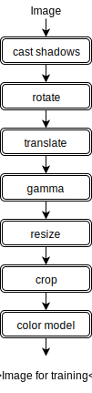
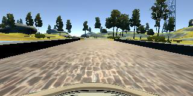
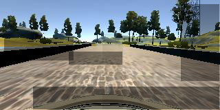
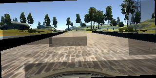
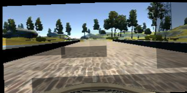
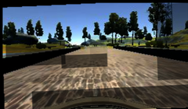
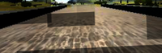
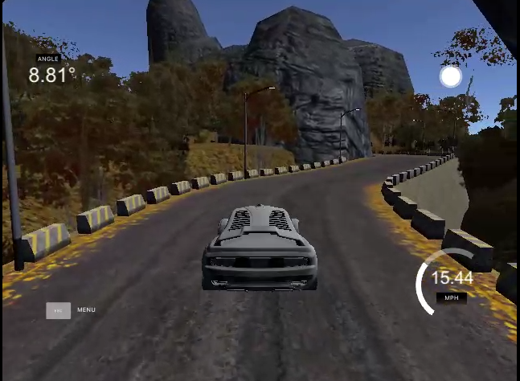

# Self-driving Car - Behavioral Transfer

This project aims to clone a driving style of a person into a self-driving car on a simulation track using deep learning.

# Deep learning setup

The architecture of the deep learning network is based on [NVidia's Dave-2](https://blogs.nvidia.com/blog/2016/05/06/self-driving-cars-3/) self-driving car. The car itself records three cameras, center, left and right in resolution of 200x66 in RGB. Only just after 72h training footage NVidia was able to drive it autonomously on regular roads using the architecture described in the following
[paper](http://images.nvidia.com/content/tegra/automotive/images/2016/solutions/pdf/end-to-end-dl-using-px.pdf).

The architecture is a [convolutional neural network](https://en.wikipedia.org/wiki/Convolutional_neural_network) (CNN) that uses 3 layers with 5x5 convolution and max pooling with 2x2 block and 2x2 downsizing, 3 layers with 3x3 convolution and max pooling with 2x2 block and no downsizing, flattening layer and 5 dense fully-connected layers. Mostly ReLU activation is used though last 3 layers use linear activation as it was providing better results. There is also one drop-out layer that similarly to max pooling reduces overfitting. 

The following diagram describes the architecture:

The training itself takes random batch of images from all three cameras and their corresponding steering values:

  

Both left and right camera images adjust the steering angle value a bit - the assumption is that when the front camera sees an image similar to our training left/right image, its steering angle must be corrected as it would otherwise run into the risk of escaping the road. This however causes a tricky situation where car might be driving from left to right and back on straights due to this enforced steering intervention. From the experience, this tends to get better with more training epochs.  

The epochs tested varied between 1-40 (taking from 10 minutes to 8 hours on GTX970), with learning rate of 0.0005, batch size of 128. Number of images was 24064, training size consisted of 19200 images and validation set of 4864 images. These were randomly chosen for each run. Adam optimizer was used so learning rate was not tuned manually.

# Image processing

On the following picture the whole image processing pipeline is described:

Processing training images is important as we can simulate different driving and lighting conditions, for example shadows on the road, sunny/dark side of mountains, morning or noon drive, bumpy roads, high-speed driving with suspension overload etc. For this a set of very basic transforms was applied.

First, we start with an original driving image. This can be taken by one of the three cameras (left, center, right).
To simulate more real-world alike conditions, we subject image to multiple different transforms:
1) **casting shadows** - this is a simple placement of a few transparent rectangles on random parts of the screen to simulate shadow effect
2) **rotation** - slight rotation can simulate driving on a bumpy road or at high speeds
3) **translation** - moving image a bit to either direction can simulate bumpy road or momentum
4) **gamma correction** - adjusting gamma can simulate different lighting conditions
5) **resize** - we don't usually need so much information as all pixels in the image, smaller one is sufficient
6) **crop** - cropping image to required input size (in our case 200x66x3)
7) **color model** - we can try different color models like RGB, HSV, HLS, Lab, greyscale etc. RGB seems to be suffficient for our model though

I tried adding random noise (Gaussian, salt & pepper etc.) however this resulted in very long training times to get it to the level of expected accuracy.

Images were passed into training process using a generator in order to avoid running out of memory.

# Step-by-step

Let's look at all steps of image processing pipeline.

Here is our input image:

First, we add a few "shadows" (currently set to vary between 0-5):

 
Second, we rotate the image a bit:

Third, we translate image in both horizontal/vertical directions a little:

Fourth, we adjust gamma of the image to simulate different lighting conditions:

Fifth, we resize the image with some "safety borders" around for clipping
 

Sixth, we crop the image to expected dimension so that it covers mainly the road:

# Results

These two HEVC movies show the performance of autonomous driving on two tracks. One is the training track, the other is a testing track.

 

What you might notice here is that car is sometimes swerving left-right on straights; this is caused by applying both stronger steering correction depending on angle as well as inability to control the speed, so steering itself is not dependent on the speed as we would expect in the real world. Obviously, an extension of this model would be to pass both steering angle and speed/throttle etc. and get the same training output.

In the second video the car stops short of reaching the end of the road on a steep climb - here more throttle would be beneficial as well.

# How to run it?

You need to have the following main libraries installed:
- [Tensorflow](https://www.tensorflow.org/) (preferably with GPU support)
- [Keras](https://keras.io/)
- [Python 3.5](https://www.python.org/)
- [matplotlib](http://matplotlib.org/)
- [Pandas](http://pandas.pydata.org/)
- [Pillow](https://python-pillow.org/)
- [NVidia CUDA](https://developer.nvidia.com/cuda-zone) and [cuDNN](https://developer.nvidia.com/cudnn)
- [scikit-image](http://scikit-image.org/)
- [NumPy](http://www.numpy.org/)
- [SciPy](http://www.scipy.org/)

To train a model, place driving log into **"data"** directory and corresponding images to **"data/IMG"** directory. Then simply run

    python model.py

After you train the model, you can test it by starting the server via
 
    python drive.py model.json

and then launching the simulator in autonomous mode. 

# What's next?

It would be great to train model with speed, acceleration, gyroscope details etc. Also, driving a real car in the world outside and using the footage instead of simulator. However, as photorealistic rendering is getting widespread, it might be sufficient to use some new simulator as well.

Results of this project could be also applied to real world, e.g. building an own Jetson-based racecar like the [Racecar from MIT](https://blogs.nvidia.com/blog/2015/10/07/robot-racecars-jetson/), collect training data by driving it around, use home supercomputer to train Dave-2 network and then let it drive autonomously and observe what could be improved.
 
Another interesting idea would be to extend this model to 3D for controlling a drone, for example a delivery drone that can have its flights restricted to a well-known area and where a smaller neural network is sufficient.