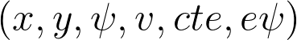
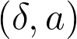
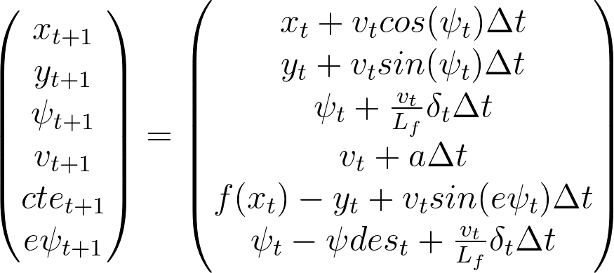
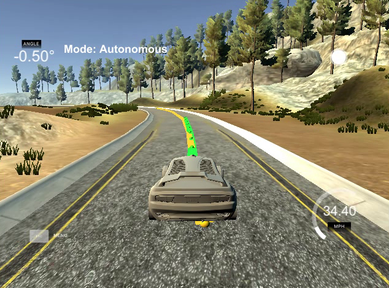

# Model Predictive Control

Model Predictive Control utilizes non-linear optimization formulation applied on a kinematic vehicle model to find out a set of actuations allowing to drive smoothly over a surface.

Kinematic model:

Vehicle can be described by the following state:

where x, y denotes vehicle's position, $\psi$ represents heading angle, v is velocity, cte is cross-track error and e$\psi$ is an error from desired heading.

This state can be changed using two actuators:

where $\delta$ is the steering angle and a is vehicle's acceleration.

Relation between old and new state in two consecutive timeframes affected by actuators is the following:

Parameters:

In the end, N=10 and dt=100ms seemed to work well and many unstable combinations were tested that aren't listed here.

Handling 100ms latency was done by taking one actuation behind, i.e. from previous timeframe, which coincidentally was exactly 100ms due to chosen dt.

Here is a video of a car making a lap around the track:
