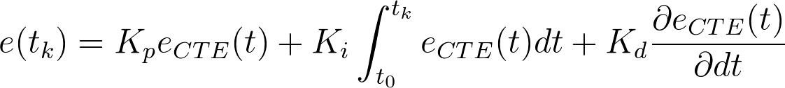
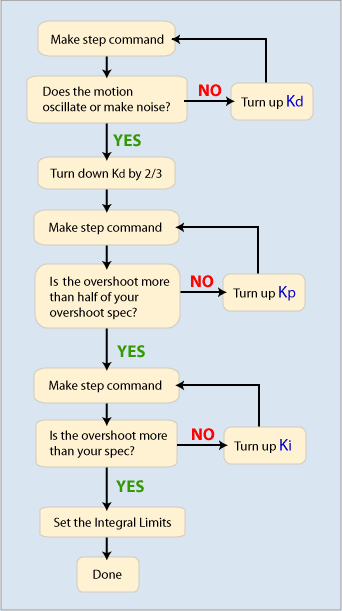
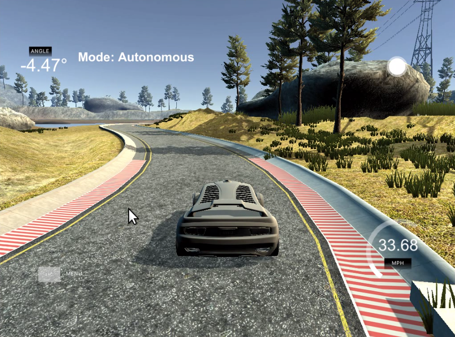

# PID Control for self-driving cars

PID controller for self-driving car in this project is based on the following formula: 

where Kp is proportional constant, Kd is derivation constant, Ki is integration constant, e_CTE is a cross-track error,
i.e. distance of a car from the center of the track and e(tk) is an overall error for a given time tk.

In the end, the parameters were chosen as follows:
Kp=0.05, Ki=6E-3, Kd=0.75

The simulation was run on a NUC5i5 (i5-5250U) @ 3840x2160@60Hz under Linux Mint 18.1 (4.4.0-53). As the simulation result varies
depending on a computer used, resulting constants might differ on your system. Please look at the attached video
to see performance on this system. 

Tuning was done manually and followed this diagram:

Here is a video of a car making a lap around the track:

