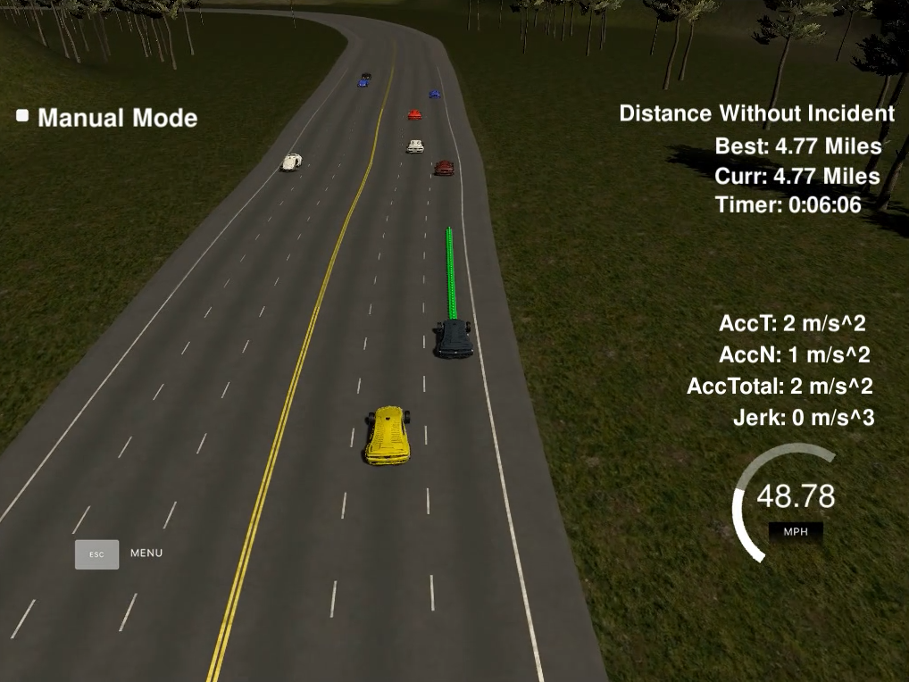

# Path Planning

In this project a futuristic vehicle autonomously navigates around a virtual highway with other traffic that is driving
within 10 MPH of the 50 MPH speed limit. The vehicle utilizes sensor fusion and localization data. The car tries
to keep 50MPH speed limit, to stay firmly within a traffic lane and to overtake slower traffic. The car should drive 
comfortably, meaning it should not experience total acceleration over 10 m/s^2 and jerk that is greater than 50 m/s^3.

## Track

The car drives on a highway loop that is 4.31miles/6.946km long. The car should take around 5 minutes to finish a single 
lap.

Here is the layout of the track:  

The track waypoints can be found [here](data/highway_map.csv). 

## Path planner

The path planning algorithm can be divided into two parts - **trajectory planner** and **lane change planner**.

### Trajectory planner
Trajectory planner uses [Frenet-Serret](https://en.wikipedia.org/wiki/Frenet%E2%80%93Serret_formulas) coordinates computed 
from vehicle coordinates and highway waypoints.

The car keeps a list of 50 pairs of ***[x, y]*** coordinates ahead. The planner converts them from pairs of  ***[s, d]*** 
Frenet coordinates, where ***s*** denotes the distance of a car from the start of the track and ***d*** its position 
within the width of highway, as depicted on the picture above. The points are evenly spaced 0.5m apart.

The simulator publishes new data with 50Hz frequency. The trajectory planner is executed on each update and tries to 
reuse previous coordinates left from previous planner step to make smooth transition between old and new trajectories,
minimizing jerk.

The act of planning itself is rather trivial; the planner prepares each new waypoint in ***[s, d]*** coordinates, then
converts them to ***[x, y]*** coordinates and passes them to simulator. To smoothen the trajectories, it uses cubic 
spline approximation using [spline tool](http://kluge.in-chemnitz.de/opensource/spline/). 

In detail, the waypoints are first generated in a way that the first two points are tangent to the angle of the car, and
subsequent points are sampled in ***[s, d]*** coordinates at the 1x, 2x and 3x look-ahead distance (LOOK_AHEAD_DISTANCE
parameter) and converted to ***[x, y]*** coordinates. Then these points are converted to car's local coordinates in order
to have points starting at ***[0, 0]*** with angle of ***0*** and cubic spline approximation is performed.

Now the new path is going to be created. First the remaining points from the previous path are copied over. Then the 
needed remaining points are obtained from the cubic spline. In order to make sure these points are roughly evenly spaced,
we first compute horizon point on the road, then divide this distance by the number of generated points and use this 
delta value to evenly space ***x*** coordinates while requesting corresponding ***y*** coordinates from the spline.
Then we project these values back to world coordinate space and add them to trajectory, so that our trajectory is always
50 waypoints long. Of course, this method works only because our curves have small curvature where the error works in our
favor; for sharper turns the goal of constant velocity might not be reached with this method.   
     
Obviously, this planner is a very simplistic approximation of a real planner as we control car's position and velocity
directly, whereas in real-world scenario we control only 1st and 2nd derivatives.

### Lane change planner
The lane change mode is entered whenever a car is too close to a car ahead in the same lane (this setting is configurable
via LOOK_AHEAD_DISTANCE). In this case, sensor fusion data are enumerated and all lanes are ranked depending on their
state. For each lane each car is observed, it's projected position after a lane change computed and then decided if
this lane is blocked or not. The corresponding code is in *getAvailableLanes*.

Lane can be **blocked** in the following cases:
- there is a car in the lane that is too close to our car
- the projected position of some car in the lane is too close to projected position of our car
- the car's initial position is behind our car but projected position after lane change ahead. Or vice versa. In such 
case a lane change would cross speedy/braking car, causing a crash

All lanes are **ranked** depending on their state. Each lane enumerates each traffic vehicle on it and computes
a **ranking score**. This score is first computed for each traffic car on the lane as ***[s]***-coordinate difference 
between our car and traffic car (distance) minus difference of speed between our car and traffic car. We prefer to rank 
higher those traffic cars that are as far as possible from our car as well as getting further away with their speed. If
a traffic car is in front of us, we like negative difference in speeds between our car and traffic car, so that the 
traffic car moves farther ahead from us; if the traffic car is behind our car, we prefer those traffic cars that are 
slower, falling further behind. As we compute this score for each car in the lane, lane is scored as a **minimum** 
of scores of all its cars. Then we choose the lane to change as the lane that has the **maximal** score. A typical case
of minimax criteria variation.   

Lane change can occur with multiple lanes. In such case, planner checks if there is no blocked lane between current 
lane and the desired lane, and allows lane change only if all lanes in-between are free.

As other cars often change lanes as well, this might cause collisions if not handled properly. To handle emergency
situations, car always scans car right ahead and if its distance becomes critically close, it applies emergency slowdown,
controlled by EMERGENCY_ACCELERATION and DANGEROUS_DISTANCE parameters.

You can notice lane change is behaving conservatively, i.e. sometimes car slows down even if it doesn't have to and 
a smooth lane change is possible. Here crash avoidance and safety was prioritized to smoothness of drive.

Line change planner utilizes track planner's capabilities and only suggests a discrete lane change, assuming trajectory 
planner can make a smooth transition without any jerks to desired lane.

## Simulator

Simulator for this project can be download from [here](https://github.com/udacity/self-driving-car-sim/releases/tag/T3_v1.2).

## Further reading
[Practical Search Techniques in Path Planning for Autonomous Driving](http://ai.stanford.edu/~ddolgov/papers/dolgov_gpp_stair08.pdf) by Dolgov, Thrun, Montemerlo, Diebel

[A Path Planning and Obstacle Avoidance Algorithm for an Autonomous Robotic Vehicle](https://webpages.uncc.edu/~jmconrad/GradStudents/Thesis_Ghangrekar.pdf) by Ghangrekar

[Introduction to Robotics #4: Path-Planning](http://correll.cs.colorado.edu/?p=965) by Correll

[Path planning](http://www.coppeliarobotics.com/helpFiles/en/pathPlanningModule.htm) by Coppelia Robotics

[The Path Planning Problem](https://www.cs.cmu.edu/afs/cs/project/jair/pub/volume9/mazer98a-html/node2.html) at CMU

[Path planning](http://www.roborealm.com/help/Path_Planning.php) at RoboRealm

[Path planning vs Motion planning](https://robotics.stackexchange.com/questions/8302/what-is-the-difference-between-path-planning-and-motion-planning) at StackOverflow

[Tutorial on A* Robot Path Planning](http://robotshop.com/letsmakerobots/excellent-tutorial-a-robot-path-planning)

[Path Planning in Environments of Different Complexity](https://de.mathworks.com/help/robotics/examples/path-planning-in-environments-of-different-complexity.html?requestedDomain=www.mathworks.com) by MatLab

[Robot Motion Planning](http://ais.informatik.uni-freiburg.de/teaching/ss11/robotics/slides/18-robot-motion-planning.pdf) by Burgard, Stachniss, Bennewitz, Arras 

[Path Planning and Collision Avoidance](http://ais.informatik.uni-freiburg.de/teaching/ss10/robotics/slides/16-pathplanning.pdf) by Burgard, Stachniss, Bennewitz, Arras

## Video

