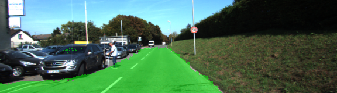
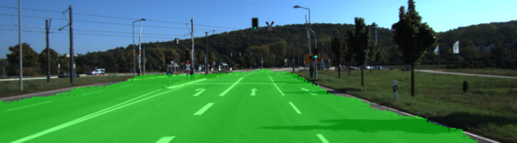
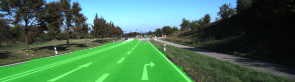
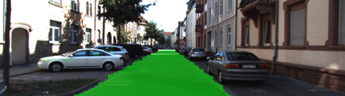

# Semantic Segmentation

This project implements Fully Convolutional Network for Semantic Segmentation as described in
[Fully Convolutional Networks for Semantic Segmentation by Long, Shelhamer, Darrell from UC Berkeley](documents/long_shelhamer_fcn.pdf),
applied to mark road surface in vehicle dashboard camera pictures.

### Performance

The model was trained on Tesla M60 (7.43GiB VRAM) with 50 epochs, batch size of 10 and produced a final loss of 0.11874.
The training took around 1 hour to complete. At least 6GiB VRAM is needed to train network (GTX 980 with 4GB VRAM was insufficient).

The dataset used was [Kitti Road dataset](http://www.cvlibs.net/datasets/kitti/eval_road.php) available [here](http://www.cvlibs.net/download.php?file=data_road.zip).
