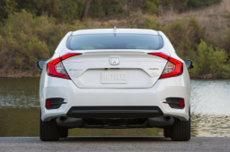
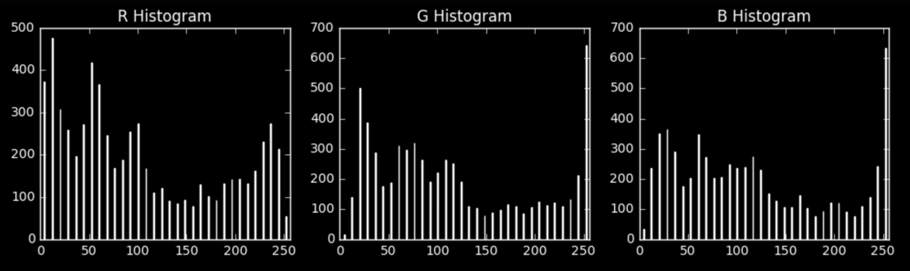
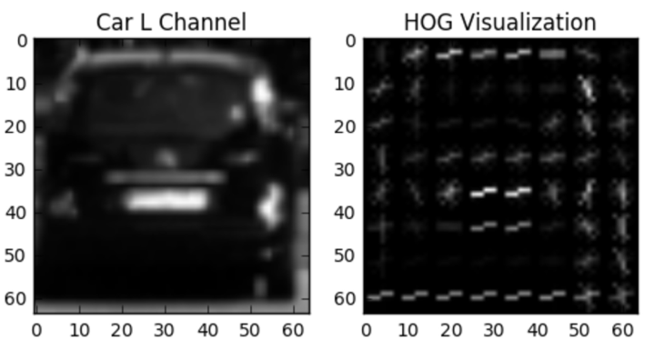
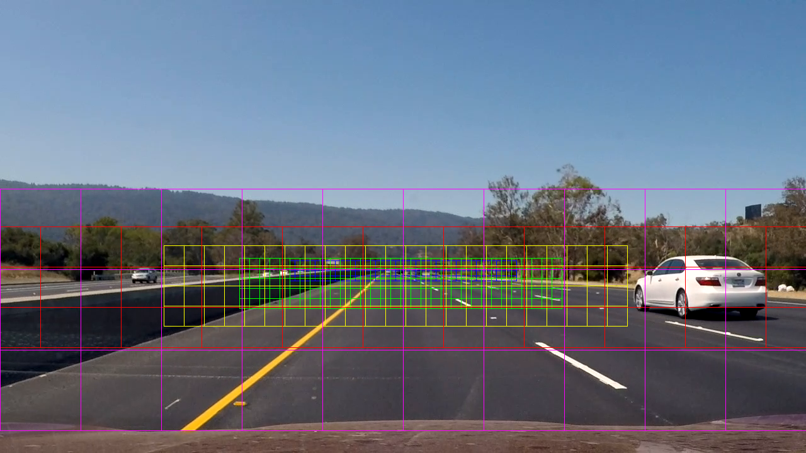
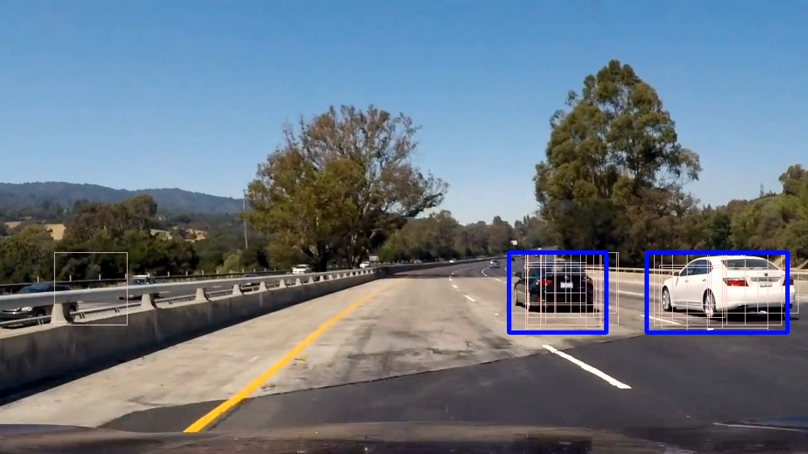
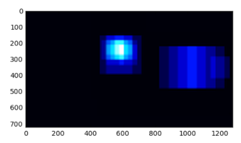
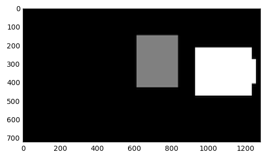
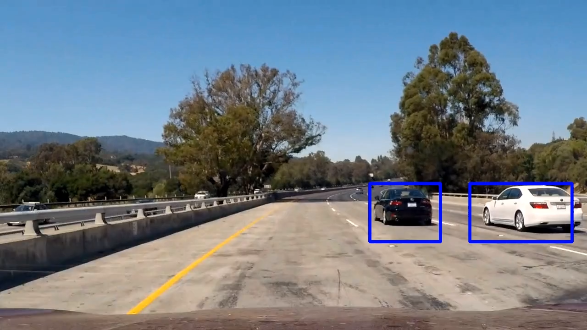

# Vehicle Detection and Tracking

In this project the goal is to detect vehicles in the scene and track them continously and accurately during driving.

# Image classification
The main problem for detecting vehicles in images lies in image classification. We need to define features
for classification and decide which classifier is going to be used.

For vehicle classification the following three features are utilized:
- [spatial binning](https://en.wikipedia.org/wiki/Data_binning)
- [color histogram](https://en.wikipedia.org/wiki/Color_histogram)
- [Histogram of Oriented Gradients (HOG)](https://en.wikipedia.org/wiki/Histogram_of_oriented_gradients)

## Training dataset
Our training dataset (located in [training directory](training_images)), contains two classes of images - vehicles
and non-vehicles. First class contains all kinds of deformed vehicles, the second part everything else that can
be a part of an image and is not a vehicle. Our intent is to train a classifier with features that can
give us reliable results.

The dataset used for classification is based on [GTI](http://www.gti.ssr.upm.es/data/Vehicle_database.html) 
and [KITTI](http://www.cvlibs.net/datasets/kitti/) datasets.

# Image features

In the beginning it was necessary to choose a few parameters, like what image features should be used
and in what color model. Each image was converted to [YCrCb](https://en.wikipedia.org/wiki/YCbCr)
color model that was providing fairly acceptable results.

## Color histogram
One possible classifier is a simple color histogram. It simply counts the number of different colors
in an image and puts these numbers to "color bins", grouping multiple similar colors. We can do histogram
for each channel and each channel split to e.g. 256 bins.

Here is an example for a single image of a vehicle:

We simply take the result of histogram for each sample and make it the first part of our "feature vector",
i.e. the vector we will use for detection/image classification. We restrict ourselves to 32 bins with a full range
of values (0-256) 

Implementation is in [classification](classification.py) source file, method **get_color_histogram_features()**.

## Spatial binning

When we look at vehicle images, we see that they keep resembling vehicles even if significantly downscaled:
 
This is implemented in [classification](classification.py) source file, method **get_spatial_binning_features()**.

So it seems like a good idea to take a heavily down-sampled image of fixed size (e.g. 32x32), and make
it a second part of our feature vector.

## Histogram of oriented gradients

A much more advanced method for detecting vehicles is 
[Histogram of Oriented Gradients (HOG)](https://en.wikipedia.org/wiki/Histogram_of_oriented_gradients). This is a 
method in the same class as [SIFT](https://en.wikipedia.org/wiki/Scale-invariant_feature_transform) based on the fact
that local object appearance and shape can be based on the distribution of intensity gradients 
(which correspond to edge directions)

This is how HOG looks like while applied on a single channel:

We apply HOG transformation on all channels and then concatenate the results. Then add them alongside
other two features to form a final feature vector for image classification.

As parameters, 9 direction bins, 8 pixels per cell and 2 cells per block are used. Obviously, 9 directions
is the number of pixels in a pixel neighborhood, and the other two parameters gave us acceptably robust
feature (8x8 pixels for gradient computation and 2x2 cells of 8x8 for histogram normalization).

Using HOG is implemented in [classification](classification.py) source file, method **get_all_hog_features()**.

# Classifier

For classification, linear [SVM](https://en.wikipedia.org/wiki/Support_vector_machine)-based classifier \
([SVC](http://scikit-learn.org/stable/modules/svm.html)) is used. In order to properly use the classifier, 
the following steps must be performed:
- randomization of the order of training images
- splitting dataset into training (80%) and testing (20%) dataset
- computing features
- rescaling features

## Order randomization
First, we randomize order of the dataset to be sure we avoid any unwanted sequence-based training effects.

## Training/testing split
Next, we split our dataset into two parts - one used for training and the other used only for final 
accuracy test.

## Computing features

All three previous image features, color histogram, spatial binning and HOG, are computed for each image 
and concatenated into a single vector.

## Rescaling

As we are working with different kinds of imagery (vehicles vs non-vehicles), it's important that both
sets have the same stochastic characteristics. We use a scaler in order to normalize these two subsets
to make sure our classifier works well on either of them. We aim for zero mean and unit variance.

Classification implementation can be found in [classification](classification.py) source file, method 
**train_classifier()**. 

# Detection and tracking

This part covers the detection and tracking pipeline:
- sliding windows search
- heat map adjustment

## Sliding window

We employ a technique of overlapping hierarchical sliding windows. We first split our screen in a number
of windows of various sizes that cover certain part of the image. This way we restrict search to appropriate
parts of the image. optimizing performance. Here you can see one possible arrangement of sliding windows: 

Sliding window algorithm is executed for each frame and works this way:
    
    for each sliding window do
        get image area covered by the window
        resize image area to classifier size
        extract spatial binning, color histogram and HOG features
        use classifier to predict if window covers a vehicle or non-vehicle
    return all windows that were classified as vehicles

Now there is a possible optimization for speeding up HOG computation - instead of computing HOG every single time,
we can compute HOG for the whole frame and then just cut the portion covered by a given sliding window.

This algorithm is however just the first part of the solution.

The issue is that the algorithm reports plenty false positives. Another filtering needs to be employed to remove
false positives from the result.

On the following picture you can see white boxes and blue boxes. Blue ones are considered to be the ones we
want to keep while white boxes that don't overlap blue ones must be removed as false positives.
The white window on the left is one such false positive:

The algorithm is implemented in [tracking](tracking.py) source file, method **find_all_vehicles()**.

## Heat maps

One way to remove false positives is to prepare heat maps from the windows that were classified as vehicles.
Heat map is an image where each pixel contains number of windows that cover it. The assumption is that
false positives are just flukes not appearing in clusters, hence their contribution to heat map
will be small. The image shows one such heat map:

To get rid of false positives, we remove all values that are under certain threshold. In implementation
we require at least two windows to cover each pixel that ends up considered for a part of a vehicle. All
other pixels that are having just one contributing window, are removed.

From this heat map after applying threshold we can extract continuous components and their dimensions: 

Bounding boxes of these components are then used as approximations of vehicle positions on the screen.

### Average heat map

Unfortunately thresholding isn't sufficient to eliminate all false positives. In addition, a rolling-sum
heat map is computed that is in each step transformed to average heat map, and on this average heat map
thresholding is applied. This has better results if a false positive appears on multiple frames or 
there are multiple overlapping false positives. From experience, setting the rolling sum size to
last 15-20 frames brings the cleanest results.

Also, the more frames are used to average heat maps, the higher is a chance of some "residual heat" staying
in the map from two nearby vehicles. For this, there is another filter applied

Heat map processing can be found in [tracking](tracking.py) source file, method **combine_detections()**.

# Result

The following video demonstrates the result of vehicle detection and tracking:

# Challenges
There were surprisingly many challenges:
- finding a proper color model; even the chosen YCrCb is not perfect
- estimating proper sliding window hierarchy's y- and x- ranges was an art
- too many false positives; a more robust classifier would be welcome
- false positives either staying on multiple frames or forming clusters; average heatmaps
were required
- using many averaging frames caused "residual heat" between formerly overlapping detection windows
that were splitting up (as in the case of two cars being near each other and then moving apart). These were dealt
with by restricting minimal size of detected vehicle.
